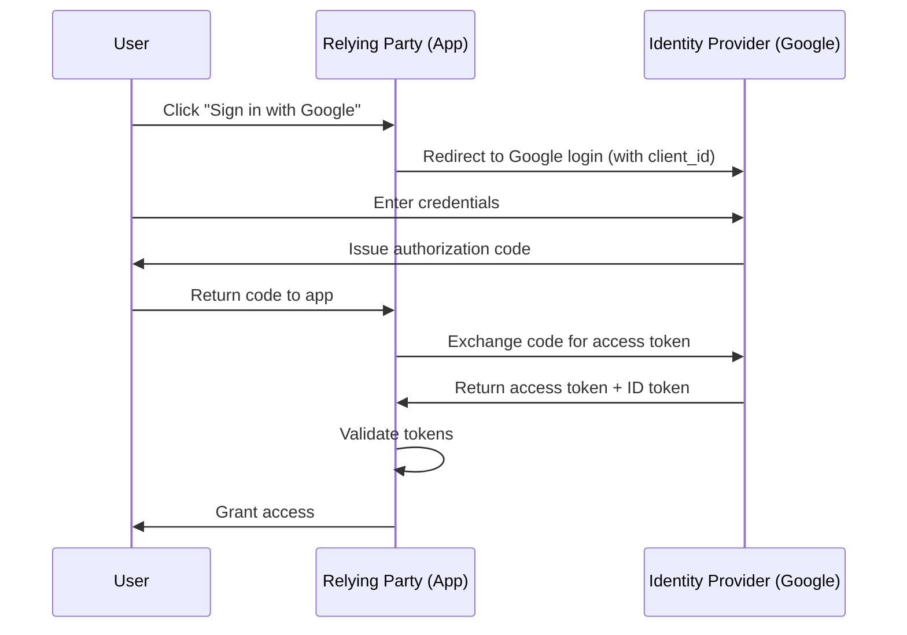

# Identity Providers and Relying Parties

Modern identity systems rely on **federation**—the practice of trusting an external authority to handle authentication. This architecture involves two key players: Identity Providers and Relying Parties.

## Identity Provider (IdP)

An **Identity Provider (IdP)** is a trusted service that authenticates users and issues identity assertions.

**Popular IdPs:**
- **Google Identity**: Enables "Sign in with Google"
- **Microsoft Azure AD / Entra ID**: Enterprise identity for Office 365, Azure
- **Okta**: Cloud-based identity provider for enterprises
- **Auth0**: Developer-friendly authentication platform
- **Keycloak**: Open-source IdP

**What IdPs Do:**
1. Authenticate users (verify credentials)
2. Store user identity information
3. Issue security tokens (assertions) to relying parties
4. Manage sessions and single sign-on (SSO)
5. Enforce authentication policies (MFA, password requirements)

## Relying Party (RP)

A **Relying Party (RP)** is an application that *relies* on an external IdP to authenticate users instead of managing credentials itself.

**Examples:**
- A SaaS app that uses "Sign in with Google" is an RP trusting Google (the IdP)
- An internal company portal trusting Azure AD
- A mobile app using OAuth to access user data from Facebook

**Benefits for RPs:**
- No password storage or credential management
- Leverage IdP's security expertise
- Enable single sign-on (SSO) across applications
- Reduce attack surface (no credential database to breach)

## The Trust Relationship

The IdP-RP relationship is built on **trust**:

1. **Registration**: RP registers with IdP, receives credentials (client ID, client secret)
2. **User Authentication**: When a user wants to access the RP, they're redirected to the IdP
3. **Assertion**: IdP authenticates user and issues a signed token/assertion
4. **Verification**: RP validates the token signature using IdP's public key
5. **Access Granted**: RP trusts the IdP's assertion and grants access

This trust is formalized through:
- **Metadata Exchange**: IdP publishes metadata (endpoints, public keys)
- **Protocol Standards**: SAML 2.0, OAuth 2.0, OpenID Connect
- **Digital Signatures**: Cryptographic proof that assertions come from the IdP

### OAuth 2.0 Flow Between IdP and RP

*Sequence diagram showing the interaction between a user, relying party application, and identity provider during OAuth 2.0 authentication*

## Federation at Scale

In enterprise environments, federation enables:

**Single Sign-On (SSO)**: Authenticate once, access many applications
- Employee logs into Azure AD in the morning
- Access Salesforce, Workday, Slack without re-authenticating

**External Collaboration**: Partner companies trusting each other's IdPs
- Contractor logs in with their company IdP
- Access client systems without separate credentials

**Social Login**: Consumer apps trusting social IdPs
- Users choose Google, Facebook, or Apple
- No password management for the app
