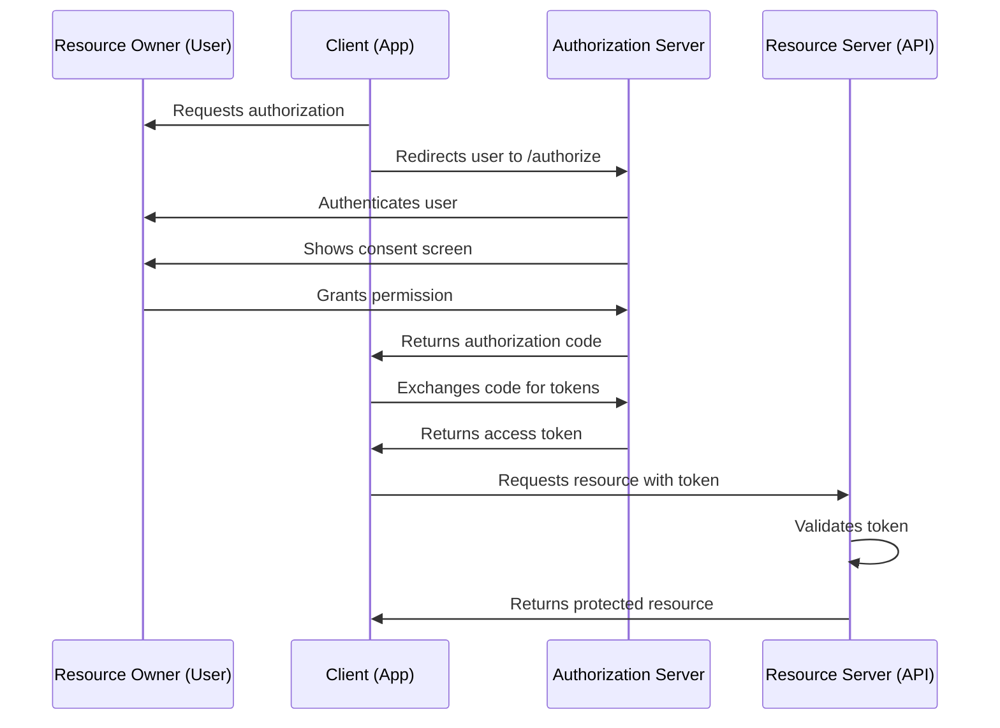

# The Four Roles of OAuth 2.0

OAuth 2.0 defines four distinct roles that interact to enable delegated authorization. Understanding these roles is essential to comprehending any OAuth flow.

## 1. Resource Owner (The User)

The **Resource Owner** is the entity (typically a human user) that owns the protected resources and can grant access to them.

**Examples:**
- A user with a Google Drive account (owns files)
- A GitHub user (owns repositories)
- A user with calendar events on Microsoft 365

**Authority:**
The Resource Owner has the power to:
- Grant or deny access to their resources
- Revoke previously granted access
- Define scope limitations (e.g., "read-only access")

**In Practice:**
When you click "Allow" on a permission dialog, you're acting as the Resource Owner, granting a client app access to your resources.

## 2. Client (The Application)

The **Client** is an application requesting access to protected resources on behalf of the Resource Owner.

**Client Types:**
- **Public Clients**: Cannot securely store credentials (mobile apps, SPAs, desktop apps)
- **Confidential Clients**: Can securely store secrets (server-side web apps, backend services)

**Examples:**
- A mobile app requesting access to your Google Photos
- A web app that posts tweets on your behalf
- A third-party analytics tool reading your GitHub stats

**Client Registration:**
Before using OAuth, clients must register with the Authorization Server to receive:
- **Client ID**: Public identifier for the application
- **Client Secret**: Confidential credential (for confidential clients only)
- **Redirect URIs**: Approved callback URLs

**Example Registration:**
```json
{
  "client_id": "abc123xyz789",
  "client_name": "Awesome Photo Editor",
  "client_secret": "secret_xyz_NEVER_EXPOSE",
  "redirect_uris": [
    "https://photoeditor.example.com/callback",
    "myapp://callback"
  ],
  "grant_types": ["authorization_code", "refresh_token"],
  "token_endpoint_auth_method": "client_secret_basic"
}
```

## 3. Authorization Server (The Gatekeeper)

The **Authorization Server** authenticates the Resource Owner and issues access tokens to the Client after obtaining authorization.

**Responsibilities:**
- Authenticate the Resource Owner
- Present consent screen (scope permissions)
- Validate Client credentials
- Issue Access Tokens, ID Tokens (OIDC), and Refresh Tokens
- Enforce security policies (MFA, conditional access)

**Popular Authorization Servers:**
- **Google Identity Platform**
- **Microsoft Azure AD / Entra ID**
- **Okta**
- **Auth0**
- **Keycloak** (open-source)

**Key Endpoints:**
```
Authorization Endpoint: /oauth/authorize
  → User authentication and consent

Token Endpoint: /oauth/token
  → Exchange codes/refresh tokens for access tokens

Introspection Endpoint: /oauth/introspect
  → Validate and inspect tokens

Revocation Endpoint: /oauth/revoke
  → Revoke tokens
```

## 4. Resource Server (The Protected API)

The **Resource Server** hosts the protected resources and validates access tokens before serving requests.

**Responsibilities:**
- Validate access tokens (signature, expiration, audience, scope)
- Enforce authorization policies
- Serve protected resources (APIs, data)
- Log access for auditing

**Examples:**
- Google Drive API (stores files)
- GitHub API (repositories, issues)
- Stripe API (payment data)

**Token Validation:**
```typescript
// Resource Server validates incoming token
app.get('/api/photos', async (req, res) => {
  const token = req.headers.authorization?.replace('Bearer ', '');

  try {
    // Validate token signature, expiration, audience
    const decoded = await validateToken(token);

    // Check required scope
    if (!decoded.scope?.includes('read:photos')) {
      return res.status(403).json({ error: 'insufficient_scope' });
    }

    // Serve protected resource
    const photos = await getPhotos(decoded.sub);
    res.json(photos);
  } catch (error) {
    res.status(401).json({ error: 'invalid_token' });
  }
});
```

## OAuth 2.0 Role Interaction



*The four OAuth 2.0 roles interacting during the authorization code flow*

## Important Distinctions

**Authorization Server vs Resource Server:**
These are often separate systems:
- **Authorization Server**: Google's OAuth server (`accounts.google.com`)
- **Resource Server**: Google Drive API (`drive.googleapis.com`)

But they can be the same system in simpler architectures.

**Resource Owner vs Client:**
- **Resource Owner**: Owns the data
- **Client**: Requests access on behalf of the Resource Owner

Critical: The Client acts on behalf of the user but is NOT the user.
