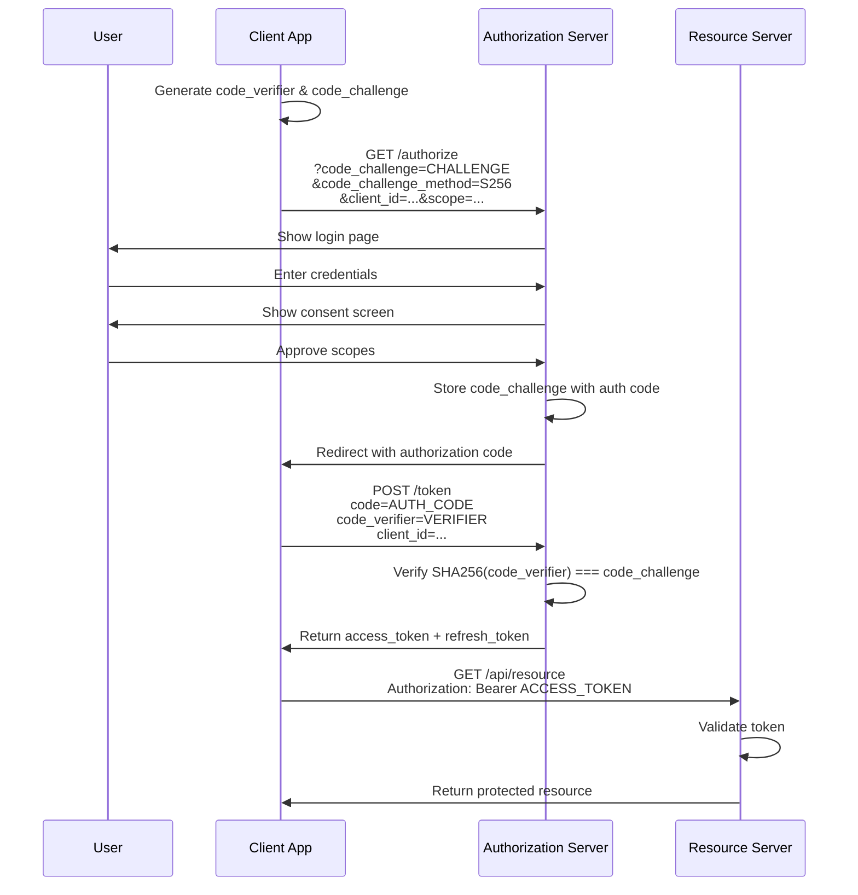

# Authorization Code Flow with PKCE

The **Authorization Code Flow** is the most secure and widely used OAuth 2.0 flow. Enhanced with **PKCE (Proof Key for Code Exchange)**, it's suitable for both server-side web apps and public clients like mobile apps and SPAs.

## Why Authorization Code Flow?

**Security Benefits:**
1. **Access token never exposed to browser**: Only authorization code passes through browser
2. **Client authentication**: Confidential clients prove identity with client secret
3. **PKCE prevents interception**: Protects public clients from authorization code theft

**Before PKCE:**
Mobile apps couldn't securely use this flow (no client secret). They used Implicit Flow, which exposed access tokens in URLs.

**After PKCE (RFC 7636, 2015):**
Public clients can use Authorization Code Flow securely without client secrets.

## PKCE: Proof Key for Code Exchange

PKCE adds cryptographic proof to prevent authorization code interception attacks.

**The Attack (without PKCE):**
1. Malicious app observes authorization code in redirect
2. Malicious app exchanges code for token (no secret required for public clients)
3. Malicious app steals user's access token

**PKCE Solution:**
1. Client generates random **code_verifier** (43-128 characters)
2. Client creates **code_challenge** = SHA256(code_verifier)
3. Client sends code_challenge with auth request
4. Authorization Server stores code_challenge with the code
5. Client sends code_verifier when exchanging code for token
6. Authorization Server verifies: SHA256(code_verifier) === code_challenge

**Result:** Only the original client that started the flow can complete it.

## Step 1: Generate PKCE Values

```typescript
// Generate PKCE code verifier and challenge
function generateCodeVerifier(): string {
  const array = new Uint8Array(32);
  crypto.getRandomValues(array);
  return base64URLEncode(array);
}

function base64URLEncode(buffer: Uint8Array): string {
  return btoa(String.fromCharCode(...buffer))
    .replace(/\+/g, '-')
    .replace(/\//g, '_')
    .replace(/=/g, '');
}

async function generateCodeChallenge(verifier: string): Promise<string> {
  const encoder = new TextEncoder();
  const data = encoder.encode(verifier);
  const hash = await crypto.subtle.digest('SHA-256', data);
  return base64URLEncode(new Uint8Array(hash));
}

// Example usage
const codeVerifier = generateCodeVerifier();
const codeChallenge = await generateCodeChallenge(codeVerifier);

console.log('Code Verifier:', codeVerifier);
// Output: "dBjftJeZ4CVP-mB92K27uhbUJU1p1r_wW1gFWFOEjXk"

console.log('Code Challenge:', codeChallenge);
// Output: "E9Melhoa2OwvFrEMTJguCHaoeK1t8URWbuGJSstw-cM"
```

## Step 2: Authorization Request

```typescript
// Redirect user to authorization endpoint
const authParams = new URLSearchParams({
  response_type: 'code',
  client_id: 'your-client-id',
  redirect_uri: 'https://yourapp.com/callback',
  scope: 'openid profile email read:data',
  state: generateRandomState(), // CSRF protection
  code_challenge: codeChallenge,
  code_challenge_method: 'S256', // SHA-256
});

const authUrl = `https://auth.example.com/oauth/authorize?${authParams}`;

// Redirect user
window.location.href = authUrl;

// User sees login screen and consent dialog
// After approval, redirected to:
// https://yourapp.com/callback?code=AUTH_CODE&state=STATE_VALUE
```

## Step 3: Token Exchange

```typescript
// Handle callback and exchange code for tokens
app.get('/callback', async (req, res) => {
  const { code, state } = req.query;

  // Verify state parameter (CSRF protection)
  if (state !== expectedState) {
    return res.status(400).send('Invalid state');
  }

  // Exchange authorization code for tokens
  const tokenResponse = await fetch('https://auth.example.com/oauth/token', {
    method: 'POST',
    headers: { 'Content-Type': 'application/x-www-form-urlencoded' },
    body: new URLSearchParams({
      grant_type: 'authorization_code',
      code: code,
      redirect_uri: 'https://yourapp.com/callback',
      client_id: 'your-client-id',
      // For confidential clients: include client_secret
      // client_secret: 'your-client-secret',
      code_verifier: codeVerifier, // PKCE verification
    }),
  });

  const tokens = await tokenResponse.json();
  /*
  {
    "access_token": "eyJhbGciOiJSUzI1NiIs...",
    "token_type": "Bearer",
    "expires_in": 3600,
    "refresh_token": "v1.MRrtPcZt...",
    "scope": "openid profile email read:data",
    "id_token": "eyJhbGciOiJSUzI1NiIs..." // if OIDC
  }
  */

  // Store tokens securely
  storeTokensSecurely(tokens);

  res.redirect('/dashboard');
});
```

## Complete Authorization Code Flow with PKCE



*Complete OAuth 2.0 authorization code flow with PKCE protection from start to API access*

## Security Best Practices

**Always Use PKCE:**
Even for confidential clients, PKCE adds defense-in-depth against code interception.

**State Parameter:**
Protects against CSRF attacks. Generate a random value, store it in session, and verify it matches on callback.

**Nonce (OIDC):**
For ID Tokens, include a nonce in the auth request and verify it in the returned ID Token to prevent replay attacks.

**Validate Redirect URIs:**
Authorization Servers must strictly validate redirect_uri against pre-registered values. Attackers exploit loose validation to steal codes.

**Short-Lived Authorization Codes:**
Codes should expire in seconds (typically 60s) and be single-use only.

**Token Storage:**
- **Web apps**: Store tokens server-side in encrypted sessions
- **Mobile apps**: Use secure storage (Keychain on iOS, Keystore on Android)
- **SPAs**: Store in memory, not localStorage (XSS risk)
