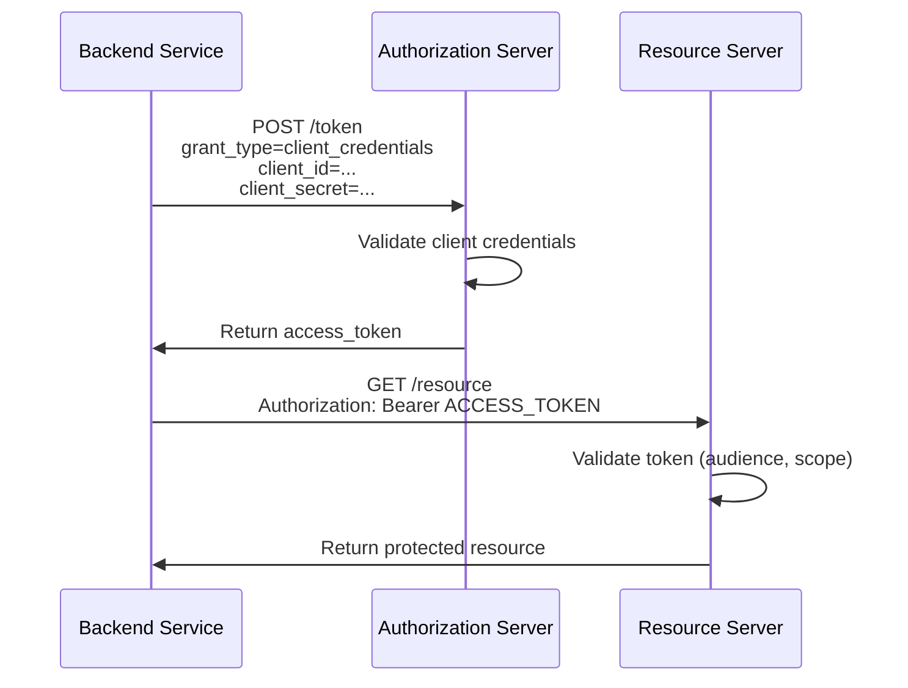

# Client Credentials Flow: Machine-to-Machine

The **Client Credentials Flow** enables machine-to-machine (M2M) authentication where no user is involved. It's designed for backend services, daemons, and CLIs that need to access APIs with their own identity.

## When to Use Client Credentials

**Use Cases:**
- **Backend Service Communication**: Microservice A calls Microservice B
- **Scheduled Jobs**: Cron job fetching data from an API
- **CLI Tools**: Developer tool authenticating to deploy infrastructure
- **System Integrations**: CRM syncing data with email service

**Key Characteristic**: No user context. The client acts on its own behalf, not on behalf of a user.

**NOT Suitable For:**
- User-facing applications
- Mobile apps
- SPAs
- Any scenario requiring user consent

## Client Credentials Request

```typescript
// Request access token using client credentials
async function getAccessToken() {
  const tokenResponse = await fetch('https://auth.example.com/oauth/token', {
    method: 'POST',
    headers: {
      'Content-Type': 'application/x-www-form-urlencoded',
      // Basic authentication with client_id and client_secret
      'Authorization': 'Basic ' + btoa(`${CLIENT_ID}:${CLIENT_SECRET}`),
    },
    body: new URLSearchParams({
      grant_type: 'client_credentials',
      scope: 'read:users write:logs', // Requested permissions
    }),
  });

  const tokens = await tokenResponse.json();
  /*
  {
    "access_token": "eyJhbGciOiJSUzI1NiIs...",
    "token_type": "Bearer",
    "expires_in": 3600,
    "scope": "read:users write:logs"
  }
  */

  return tokens.access_token;
}

// Use the token to call an API
async function callAPI() {
  const accessToken = await getAccessToken();

  const response = await fetch('https://api.example.com/users', {
    headers: {
      'Authorization': `Bearer ${accessToken}`,
    },
  });

  return response.json();
}
```

## Client Credentials Flow Diagram



*Machine-to-machine OAuth 2.0 client credentials flow without user involvement*

## Security Considerations

**Client Secret Protection:**
The client secret is the only credential. If leaked, anyone can obtain access tokens.

**Best Practices:**
1. **Environment Variables**: Never hardcode secrets
2. **Secret Rotation**: Regularly rotate client secrets
3. **Secret Managers**: Use AWS Secrets Manager, Azure Key Vault, HashiCorp Vault
4. **Least Privilege**: Request only necessary scopes
5. **Network Security**: Use mTLS for additional client authentication

**Example: Using Environment Variables**
```typescript
const CLIENT_ID = process.env.OAUTH_CLIENT_ID;
const CLIENT_SECRET = process.env.OAUTH_CLIENT_SECRET;

if (!CLIENT_ID || !CLIENT_SECRET) {
  throw new Error('OAuth credentials not configured');
}
```

**Token Caching:**
Client credentials tokens don't contain user context, so they can be cached and reused until expiration:

```typescript
let cachedToken: { token: string; expiresAt: number } | null = null;

async function getAccessToken(): Promise<string> {
  // Return cached token if still valid
  if (cachedToken && Date.now() < cachedToken.expiresAt) {
    return cachedToken.token;
  }

  // Fetch new token
  const response = await fetch('https://auth.example.com/oauth/token', {
    method: 'POST',
    headers: {
      'Content-Type': 'application/x-www-form-urlencoded',
      'Authorization': 'Basic ' + btoa(`${CLIENT_ID}:${CLIENT_SECRET}`),
    },
    body: new URLSearchParams({
      grant_type: 'client_credentials',
      scope: 'api:access',
    }),
  });

  const data = await response.json();

  // Cache token with buffer time before expiration
  cachedToken = {
    token: data.access_token,
    expiresAt: Date.now() + (data.expires_in - 60) * 1000, // 60s buffer
  };

  return cachedToken.token;
}
```

## Alternative: Mutual TLS (mTLS)

For high-security environments, **mTLS** provides certificate-based client authentication:

1. Client presents X.509 certificate during TLS handshake
2. Authorization Server validates certificate against trusted CA
3. No client secret needed (certificate is the credential)

**Benefits:**
- Stronger than shared secrets
- Certificate rotation via PKI infrastructure
- Non-repudiation (cryptographic proof of client identity)

**OAuth 2.0 Mutual-TLS Client Authentication (RFC 8705)** standardizes this approach.
