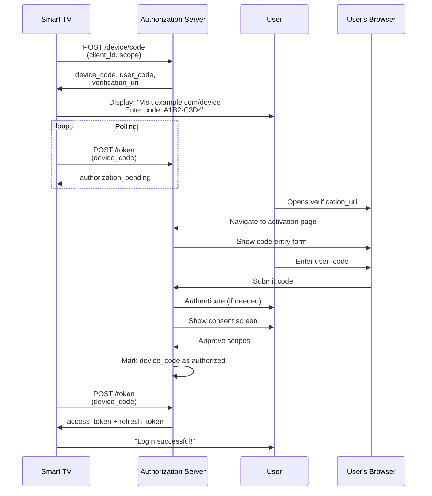

# Device Code Flow: Input-Constrained Devices

The **Device Code Flow (RFC 8628)** solves authentication for devices that lack easy text input or a web browser, such as smart TVs, streaming devices, and IoT gadgets.

## The Problem

Entering complex passwords with a TV remote is painful. Devices like:
- **Smart TVs** (Netflix, YouTube apps)
- **Streaming Devices** (Roku, Apple TV, Chromecast)
- **Game Consoles** (PlayStation, Xbox)
- **IoT Devices** (smart speakers, printers)

These devices need OAuth authentication but can't easily collect credentials.

## The Solution: Device Code Flow

**User Experience:**
1. TV app displays: "Go to https://example.com/device and enter code: **A1B2-C3D4**"
2. User opens their phone/computer browser
3. User visits the URL and enters the code
4. User authenticates and approves
5. TV app automatically logs in

**No credential entry on the device itself.**

## Step 1: Device Requests Code

```typescript
// Device (TV app) initiates flow
async function initiateDeviceFlow() {
  const response = await fetch('https://auth.example.com/oauth/device/code', {
    method: 'POST',
    headers: { 'Content-Type': 'application/x-www-form-urlencoded' },
    body: new URLSearchParams({
      client_id: 'smart-tv-app',
      scope: 'profile email video:stream',
    }),
  });

  const data = await response.json();
  /*
  {
    "device_code": "GmRhmhcxhwAzkoEqiMEg_DnyEysNkuNhszIySk9eS",
    "user_code": "A1B2-C3D4",
    "verification_uri": "https://example.com/device",
    "verification_uri_complete": "https://example.com/device?code=A1B2-C3D4",
    "expires_in": 1800,
    "interval": 5
  }
  */

  return data;
}

// Display to user
const deviceFlow = await initiateDeviceFlow();
console.log(`Go to ${deviceFlow.verification_uri}`);
console.log(`Enter code: ${deviceFlow.user_code}`);
// Optionally show QR code with verification_uri_complete
```

## Step 2: Device Polls for Token

```typescript
// Device polls authorization server for token
async function pollForToken(deviceCode: string, interval: number) {
  while (true) {
    await sleep(interval * 1000); // Wait before polling

    const response = await fetch('https://auth.example.com/oauth/token', {
      method: 'POST',
      headers: { 'Content-Type': 'application/x-www-form-urlencoded' },
      body: new URLSearchParams({
        grant_type: 'urn:ietf:params:oauth:grant-type:device_code',
        device_code: deviceCode,
        client_id: 'smart-tv-app',
      }),
    });

    const data = await response.json();

    if (response.ok) {
      // Success! User approved
      return data.access_token;
    }

    if (data.error === 'authorization_pending') {
      // User hasn't approved yet, continue polling
      continue;
    }

    if (data.error === 'slow_down') {
      // We're polling too fast, increase interval
      interval += 5;
      continue;
    }

    if (data.error === 'expired_token') {
      throw new Error('Device code expired');
    }

    if (data.error === 'access_denied') {
      throw new Error('User denied access');
    }

    throw new Error(`Unexpected error: ${data.error}`);
  }
}

function sleep(ms: number) {
  return new Promise(resolve => setTimeout(resolve, ms));
}
```

## Device Code Flow - Complete Sequence



*Device code flow showing simultaneous device polling and user authorization on a separate device*

## Security Considerations

**User Code Properties:**
- Short (6-8 characters)
- Easy to type (avoid ambiguous characters: O vs 0, I vs 1)
- Case-insensitive
- Time-limited (typically 15-30 minutes)

**Polling Best Practices:**
- Respect the `interval` parameter (typically 5 seconds)
- Handle `slow_down` errors by increasing interval
- Stop polling after code expiration
- Don't hammer the server (leads to rate limiting)

**UX Improvements:**
- Display QR code with `verification_uri_complete` for easier mobile scanning
- Show countdown timer for code expiration
- Animate polling state (e.g., "Waiting for approval...")

**Attack Mitigation:**
- Device codes must be single-use
- Short expiration windows
- Rate limiting on code verification endpoint
- Optional: Require device code + client secret for confidential clients
