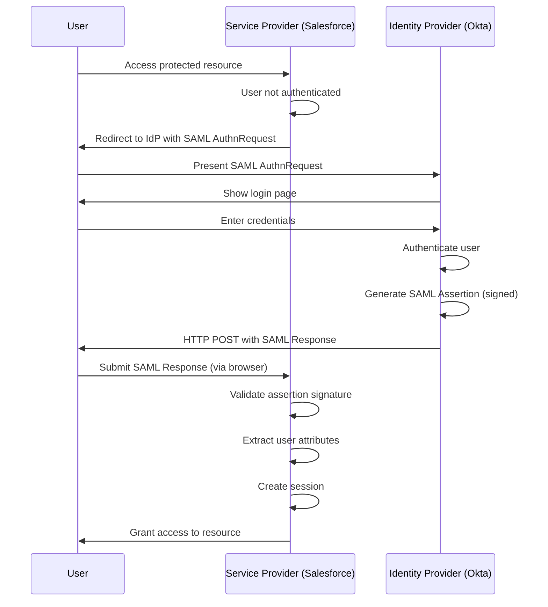

# SAML 2.0 Fundamentals

## What is SAML?

**SAML (Security Assertion Markup Language)** is an XML-based open standard for exchanging authentication and authorization data between parties, specifically between an **Identity Provider (IdP)** and a **Service Provider (SP)**.

## Key Characteristics

### XML-Based Protocol
- Uses XML for encoding assertions and messages
- Leverages XML Signature and XML Encryption for security
- Human-readable but verbose compared to JSON (OAuth/OIDC)

### Enterprise-Focused
- Designed for enterprise Single Sign-On (SSO)
- Widely used in B2B and enterprise applications
- Strong in federated identity scenarios

### Mature Standard
- SAML 2.0 released in 2005 by OASIS
- Battle-tested in enterprise environments
- Extensive tooling and library support

## SAML vs. OAuth/OIDC

| Feature | SAML 2.0 | OAuth 2.0 | OpenID Connect |
|---------|----------|-----------|----------------|
| **Primary Purpose** | Authentication + Authorization | Delegated Authorization | Authentication |
| **Data Format** | XML | JSON | JSON (JWT) |
| **Token Type** | SAML Assertions | Access Tokens | ID Tokens + Access Tokens |
| **Typical Use Case** | Enterprise SSO, B2B | API access, mobile apps | Consumer login, modern SSO |
| **Browser-Based** | Yes (HTTP POST/Redirect) | Yes + Native apps | Yes + Native apps |
| **Mobile Support** | Limited | Excellent | Excellent |
| **Complexity** | High (XML, crypto) | Medium | Medium |
| **Year Introduced** | 2005 | 2012 | 2014 |

## When to Use SAML

### Use SAML when:
- Implementing enterprise SSO (Salesforce, Workday, ServiceNow)
- B2B federation with other organizations
- Existing SAML infrastructure in place
- Compliance requirements mandate SAML
- Legacy enterprise applications require it

### Avoid SAML when:
- Building mobile or native applications
- Modern web APIs (prefer OAuth 2.0)
- Consumer-facing applications (prefer OIDC)
- Microservices architectures
- You want simplicity and JSON-based protocols

## SAML Architecture and Components

### 1. Identity Provider (IdP)

The **Identity Provider** is the system that:
- Authenticates users (checks credentials)
- Issues SAML assertions about authenticated users
- Manages user identities and attributes
- Signs assertions to prove authenticity

**Examples:**
- **Okta** - Cloud IdP platform
- **Microsoft Entra ID (Azure AD)** - Enterprise identity
- **Ping Identity** - Enterprise federation
- **Auth0** - Cloud identity platform
- **Google Workspace** - Consumer and enterprise
- **OneLogin** - Cloud SSO provider

### 2. Service Provider (SP)

The **Service Provider** is the application that:
- Trusts assertions from the IdP
- Validates SAML assertion signatures
- Grants access based on assertion claims
- Does NOT authenticate users directly

**Examples:**
- **Salesforce** - CRM platform
- **Workday** - HR management system
- **ServiceNow** - IT service management
- **Slack** - Team collaboration
- **Zoom** - Video conferencing
- **GitHub Enterprise** - Code collaboration

### 3. SAML Assertions

**SAML Assertions** are XML documents that contain claims about a user. There are three types:

**Authentication Assertion**
- States that a user was authenticated
- Includes authentication method and timestamp
- Confirms identity

**Attribute Assertion**
- Contains attributes about the user
- Examples: email, name, department, role
- Used for personalization and authorization

**Authorization Decision Assertion**
- States whether user is authorized for specific resource
- Less commonly used in practice
- Application usually handles authorization

### 4. Metadata

**SAML Metadata** describes the configuration of IdPs and SPs:

- **EntityID**: Unique identifier for IdP or SP
- **Endpoints**: URLs for SSO, SLO (Single Logout)
- **Certificates**: Public keys for signature validation
- **Bindings**: Supported protocols (HTTP-POST, HTTP-Redirect)
- **NameID Formats**: How users are identified

Metadata is exchanged during initial setup to establish trust.

## SAML SSO Flow (SP-Initiated)



## SAML Flow Types

### SP-Initiated Flow

**Most Common Flow**

1. User accesses Service Provider (e.g., Salesforce)
2. SP detects user is not authenticated
3. SP sends **AuthnRequest** to IdP (via browser redirect)
4. IdP authenticates user
5. IdP sends **SAML Response** with assertion back to SP
6. SP validates assertion and grants access

**Use Case:** User directly navigates to application URL

### IdP-Initiated Flow

**Less Common, More Convenient**

1. User logs into IdP portal (e.g., Okta dashboard)
2. User clicks on app icon (e.g., Salesforce)
3. IdP generates SAML assertion
4. IdP posts assertion directly to SP
5. SP validates assertion and grants access

**Use Case:** Users start from a centralized portal

> **Security Note:** IdP-initiated flow is more vulnerable to CSRF attacks because there's no initial request from SP to bind the session.

### Just-in-Time (JIT) Provisioning

Many SAML implementations support **JIT user provisioning**:

- User doesn't exist in SP's user database
- SP receives SAML assertion with user attributes
- SP automatically creates user account based on assertion
- User is granted access immediately

**Benefits:**
- No manual user provisioning
- Automatic user attribute synchronization
- Reduced administrative overhead

## SAML Trust Establishment

### How Trust Works in SAML

#### Certificate Exchange

Before SAML SSO works, IdP and SP must establish trust:

**1. IdP Configuration**
- IdP administrator uploads IdP metadata to SP
- Metadata includes IdP's public certificate
- SP stores certificate to validate future assertions

**2. SP Configuration**
- SP administrator uploads SP metadata to IdP
- Metadata includes SP's Assertion Consumer Service (ACS) URL
- IdP knows where to send assertions

**3. Entity IDs**
- IdP has unique EntityID (e.g., `http://www.okta.com/exk1234567890`)
- SP has unique EntityID (e.g., `https://salesforce.com`)
- These are used to identify parties in SAML messages

### Signature Validation

**IdP Signs Assertions:**
```xml
<saml:Assertion ID="_abc123" IssueInstant="2024-01-15T10:30:00Z">
  <ds:Signature>
    <ds:SignedInfo>
      <ds:Reference URI="#_abc123">
        <ds:DigestValue>...</ds:DigestValue>
      </ds:Reference>
    </ds:SignedInfo>
    <ds:SignatureValue>...</ds:SignatureValue>
  </ds:Signature>
  {/* Assertion content */}
</saml:Assertion>
```

**SP Validates Signature:**
1. Extract signature from assertion
2. Use IdP's public certificate (from metadata)
3. Verify signature matches assertion content
4. If valid, trust the assertion claims

> **Security Tip:** Always validate SAML assertion signatures. An unsigned or invalidly signed assertion should be rejected immediately.

### Metadata Example

**IdP Metadata (simplified):**
```xml
<EntityDescriptor entityID="http://www.okta.com/exk123">
  <IDPSSODescriptor>
    <KeyDescriptor use="signing">
      <ds:KeyInfo>
        <ds:X509Data>
          <ds:X509Certificate>MIIDpDCCAoygAwIBAgIGAXo...</ds:X509Certificate>
        </ds:X509Data>
      </ds:KeyInfo>
    </KeyDescriptor>
    <SingleSignOnService
      Binding="urn:oasis:names:tc:SAML:2.0:bindings:HTTP-POST"
      Location="https://example.okta.com/app/salesforce/sso/saml"/>
  </IDPSSODescriptor>
</EntityDescriptor>
```

**SP Metadata (simplified):**
```xml
<EntityDescriptor entityID="https://salesforce.com">
  <SPSSODescriptor>
    <AssertionConsumerService
      Binding="urn:oasis:names:tc:SAML:2.0:bindings:HTTP-POST"
      Location="https://example.salesforce.com/saml/consume"
      index="0"/>
  </SPSSODescriptor>
</EntityDescriptor>
```

## Key Concepts Review

**Question 1:** What is the primary purpose of SAML?
- A) API access delegation
- B) Enterprise Single Sign-On
- C) Mobile authentication
- D) Database encryption

**Question 2:** Which format does SAML use?
- A) JSON
- B) YAML
- C) XML
- D) Protocol Buffers

**Question 3:** In SP-initiated flow, who sends the initial request?
- A) Identity Provider
- B) Service Provider
- C) User's browser
- D) Authorization Server

**Question 4:** What validates a SAML assertion's authenticity?
- A) Password hash
- B) Digital signature
- C) API key
- D) Bearer token

<details>
<summary>View Answers</summary>

1. **B** - Enterprise Single Sign-On is SAML's primary purpose
2. **C** - XML is SAML's data format
3. **B** - Service Provider sends the AuthnRequest
4. **B** - Digital signature using IdP's certificate validates assertions
</details>
