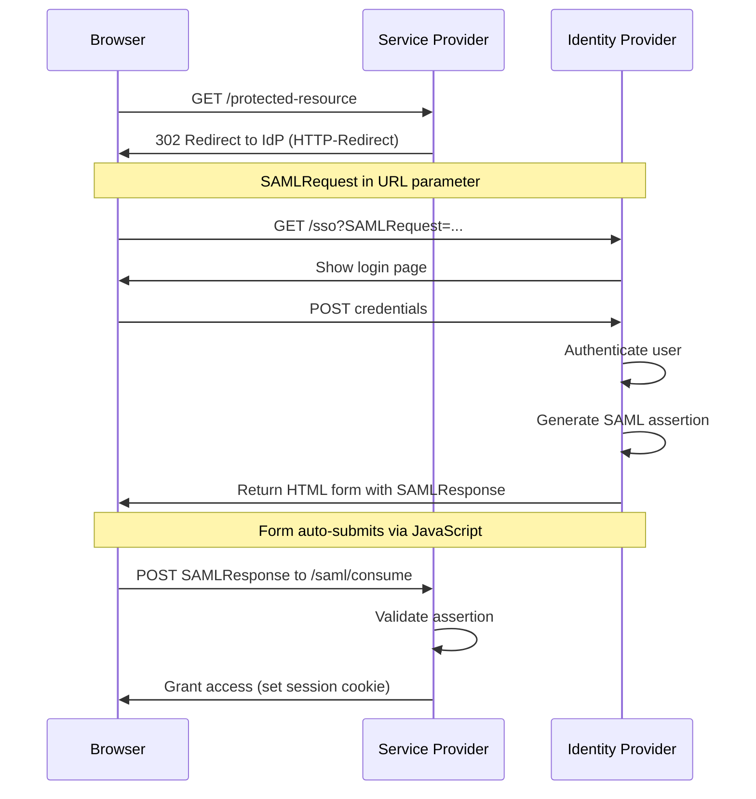

# SAML Bindings and Protocols

## What are SAML Bindings?

**SAML Bindings** define how SAML messages (requests and responses) are transported between IdP and SP.

### Why Bindings Matter

SAML is an XML-based protocol, but XML messages need to be:
- **Transported** over the network (HTTP, SOAP, etc.)
- **Encoded** for safe transmission
- **Delivered** to the right endpoint

Bindings solve these challenges by mapping SAML messages to transport protocols.

## Common SAML Bindings

### 1. HTTP-POST Binding

**Most Common for Responses**

How it works:
1. IdP generates SAML assertion
2. IdP creates HTML form with assertion in hidden field
3. Form auto-submits via JavaScript to SP's ACS URL
4. Browser POSTs assertion to SP

**Example HTML Form:**
```html
<form method="POST" action="https://salesforce.com/saml/consume">
  <input type="hidden" name="SAMLResponse" value="PD94bWwgdm...base64..."/>
  <input type="submit" value="Continue"/>
</form>
<script>
  document.forms[0].submit();
</script>
```

**Characteristics:**
- ✅ Can handle large assertions (no URL length limits)
- ✅ More secure (assertion not in URL)
- ✅ Works with complex attributes
- ❌ Requires JavaScript for auto-submit
- ❌ Slightly slower than HTTP-Redirect

### 2. HTTP-Redirect Binding

**Most Common for Requests**

How it works:
1. SP creates SAML AuthnRequest
2. SP compresses and Base64-encodes request
3. SP redirects browser to IdP with request in URL parameter
4. IdP receives and processes request

**Example Redirect URL:**
```
https://idp.example.com/sso?SAMLRequest=fZJNT8MwDIb%2FSn...&RelayState=abc123
```

**Characteristics:**
- ✅ Simple, no JavaScript required
- ✅ Fast (single redirect)
- ✅ No form submission
- ❌ URL length limits (~2048 chars)
- ❌ Request visible in browser history
- ❌ Not suitable for large messages

### 3. HTTP-Artifact Binding

**Enterprise, High-Security**

How it works:
1. IdP generates assertion
2. IdP creates short "artifact" (reference token)
3. IdP sends artifact to SP via browser redirect
4. SP uses back-channel SOAP call to retrieve actual assertion from IdP

**Flow:**
```
Browser: User → SP → IdP → SP (with artifact)
Back-channel: SP → IdP (fetch assertion) → SP
```

**Characteristics:**
- ✅ Assertion never passes through browser
- ✅ More secure (back-channel only)
- ✅ No URL length issues
- ❌ More complex setup
- ❌ Requires back-channel connectivity
- ❌ Rarely used in modern implementations

### 4. SOAP Binding

**Legacy, Back-Channel**

- Used for back-channel communication
- Requires direct network connectivity
- Common in older enterprise setups
- Being replaced by RESTful approaches

## HTTP-POST Binding Flow



## SAML Request (AuthnRequest)

The **AuthnRequest** is sent from SP to IdP to initiate authentication.

### AuthnRequest Structure

```xml
<samlp:AuthnRequest
  xmlns:samlp="urn:oasis:names:tc:SAML:2.0:protocol"
  xmlns:saml="urn:oasis:names:tc:SAML:2.0:assertion"
  ID="_request123"
  Version="2.0"
  IssueInstant="2024-01-15T10:30:00Z"
  Destination="https://idp.example.com/sso"
  AssertionConsumerServiceURL="https://salesforce.com/saml/consume"
  ProtocolBinding="urn:oasis:names:tc:SAML:2.0:bindings:HTTP-POST">

  <saml:Issuer>https://salesforce.com</saml:Issuer>

  <samlp:NameIDPolicy
    Format="urn:oasis:names:tc:SAML:1.1:nameid-format:emailAddress"
    AllowCreate="true"/>

  <samlp:RequestedAuthnContext Comparison="exact">
    <saml:AuthnContextClassRef>
      urn:oasis:names:tc:SAML:2.0:ac:classes:PasswordProtectedTransport
    </saml:AuthnContextClassRef>
  </samlp:RequestedAuthnContext>
</samlp:AuthnRequest>
```

### Key Fields

**ID**: Unique request identifier
- SP generates random ID
- Used to prevent replay attacks
- Referenced in response's `InResponseTo`

**Destination**: IdP's SSO endpoint
- Where browser should be redirected
- Validates request is for correct IdP

**AssertionConsumerServiceURL (ACS URL)**: Where to send response
- SP's endpoint for receiving assertions
- IdP POSTs assertion here
- Must match metadata configuration

**ProtocolBinding**: How response should be sent
- Usually HTTP-POST for responses
- Tells IdP which binding to use

**Issuer**: SP's EntityID
- Identifies which SP sent request
- IdP uses this to load SP's configuration

**NameIDPolicy**: Requested identifier format
- SP requests specific NameID format
- `AllowCreate="true"` allows JIT provisioning

**RequestedAuthnContext**: Required authentication strength
- SP can request minimum auth level
- Example: Require MFA for admin access
- `Comparison="exact"` means exact match required

### RelayState Parameter

**RelayState** preserves application state during SSO:

```
https://idp.example.com/sso?SAMLRequest=...&RelayState=/dashboard
```

**Purpose:**
- Remembers where user was trying to go
- Passed through IdP unchanged
- Returned to SP in SAML response
- SP redirects user to original destination

**Example Flow:**
1. User tries to access `/dashboard`
2. SP sends AuthnRequest with `RelayState=/dashboard`
3. User authenticates at IdP
4. IdP returns assertion with `RelayState=/dashboard`
5. SP creates session and redirects to `/dashboard`

> **Security Note:** Always validate RelayState to prevent open redirect vulnerabilities. Only redirect to allowed paths within your application.

## SAML Response

The **SAML Response** is sent from IdP to SP containing the assertion.

### Response Structure

```xml
<samlp:Response
  xmlns:samlp="urn:oasis:names:tc:SAML:2.0:protocol"
  xmlns:saml="urn:oasis:names:tc:SAML:2.0:assertion"
  ID="_response456"
  Version="2.0"
  IssueInstant="2024-01-15T10:30:00Z"
  Destination="https://salesforce.com/saml/consume"
  InResponseTo="_request123">

  <saml:Issuer>http://www.okta.com/exk123</saml:Issuer>

  <samlp:Status>
    <samlp:StatusCode Value="urn:oasis:names:tc:SAML:2.0:status:Success"/>
  </samlp:Status>

  <saml:Assertion>
    {/* Full assertion here (see previous lesson) */}
  </saml:Assertion>
</samlp:Response>
```

### Response Validation Steps

**SP must validate:**

1. **Signature**: Verify response/assertion signature
2. **InResponseTo**: Match to original request ID
3. **Destination**: Ensure it's intended for this SP
4. **Issuer**: Verify it's from trusted IdP
5. **Status**: Check for Success status
6. **Conditions**: Validate NotBefore/NotOnOrAfter
7. **Audience**: Must match SP's EntityID
8. **Replay Protection**: Ensure assertion ID hasn't been used before

**Example Validation Code (pseudocode):**
```python
def validate_saml_response(response, original_request_id):
    # 1. Verify signature using IdP's public certificate
    if not verify_signature(response, idp_certificate):
        raise SecurityError("Invalid signature")

    # 2. Check InResponseTo matches request
    if response.in_response_to != original_request_id:
        raise SecurityError("InResponseTo mismatch")

    # 3. Validate destination
    if response.destination != SP_ACS_URL:
        raise SecurityError("Invalid destination")

    # 4. Check status
    if response.status != "Success":
        raise AuthenticationError("Authentication failed")

    # 5. Validate assertion conditions
    assertion = response.assertion
    now = datetime.utcnow()

    if assertion.not_before > now or assertion.not_on_or_after < now:
        raise SecurityError("Assertion expired or not yet valid")

    # 6. Validate audience
    if assertion.audience != SP_ENTITY_ID:
        raise SecurityError("Assertion not for this SP")

    # 7. Prevent replay attacks
    if assertion_id_already_used(assertion.id):
        raise SecurityError("Assertion replay detected")

    mark_assertion_as_used(assertion.id)

    return assertion
```

### Error Responses

IdP can return error status codes:

```xml
<samlp:Status>
  <samlp:StatusCode Value="urn:oasis:names:tc:SAML:2.0:status:Responder">
    <samlp:StatusCode Value="urn:oasis:names:tc:SAML:2.0:status:AuthnFailed"/>
  </samlp:StatusCode>
  <samlp:StatusMessage>Invalid credentials</samlp:StatusMessage>
</samlp:Status>
```

**Common Status Codes:**
- **Success**: Authentication succeeded
- **Requester**: Error in request (invalid format, missing required field)
- **Responder**: IdP error (authentication failed, internal error)
- **VersionMismatch**: SAML version not supported
- **AuthnFailed**: User authentication failed
- **InvalidNameIDPolicy**: Requested NameID format not supported

## Encoding/Decoding SAML Messages

### ENCODING (SP to IdP)

```python
import base64
import zlib
from urllib.parse import quote, unquote

def encode_authn_request(authn_request_xml):
    """
    Encode SAML AuthnRequest for HTTP-Redirect binding

    Steps:
    1. Deflate compress (zlib)
    2. Base64 encode
    3. URL encode
    """
    # Step 1: Deflate compress
    compressed = zlib.compress(authn_request_xml.encode('utf-8'))[2:-4]

    # Step 2: Base64 encode
    base64_encoded = base64.b64encode(compressed)

    # Step 3: URL encode
    url_encoded = quote(base64_encoded)

    return url_encoded

# Example usage
authn_request = """<?xml version="1.0"?>
<samlp:AuthnRequest ...>
  <saml:Issuer>https://salesforce.com</saml:Issuer>
  ...
</samlp:AuthnRequest>"""

encoded = encode_authn_request(authn_request)
redirect_url = f"https://idp.example.com/sso?SAMLRequest={encoded}&RelayState=/dashboard"
```

### HTTP-POST ENCODING (IdP to SP)

```python
def encode_saml_response(saml_response_xml):
    """
    Encode SAML Response for HTTP-POST binding

    Note: No compression for POST (only Base64)
    """
    # Just Base64 encode (no compression)
    base64_encoded = base64.b64encode(saml_response_xml.encode('utf-8'))
    return base64_encoded.decode('utf-8')

# Example usage (IdP sending response)
saml_response = """<?xml version="1.0"?>
<samlp:Response ...>
  <saml:Assertion>...</saml:Assertion>
</samlp:Response>"""

encoded_response = encode_saml_response(saml_response)

html_form = f"""
<html>
<body onload="document.forms[0].submit()">
  <form method="POST" action="https://salesforce.com/saml/consume">
    <input type="hidden" name="SAMLResponse" value="{encoded_response}"/>
    <input type="hidden" name="RelayState" value="/dashboard"/>
    <noscript>
      <input type="submit" value="Continue"/>
    </noscript>
  </form>
</body>
</html>
"""
```

### DECODING (SP receiving response)

```python
def decode_saml_response(encoded_response):
    """
    Decode SAML Response from HTTP-POST
    """
    # Just Base64 decode (no decompression)
    decoded = base64.b64decode(encoded_response)
    return decoded.decode('utf-8')

# Example usage (SP side)
received_response = "PD94bWwgdm..."  # From POST parameter
decoded_response_xml = decode_saml_response(received_response)
print("Received SAML Response:")
print(decoded_response_xml)
```
