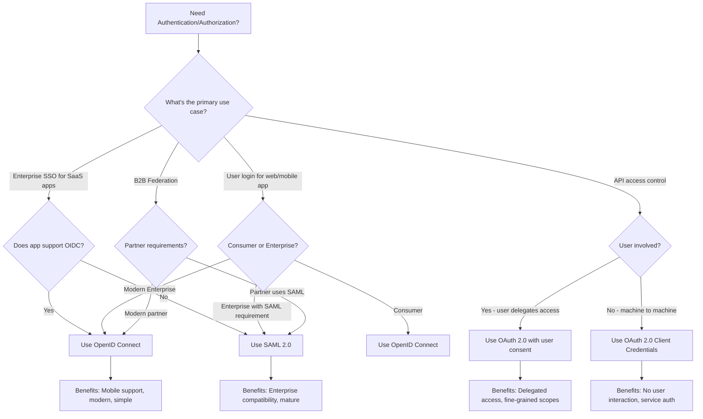

# SAML vs. OAuth 2.0 vs. OpenID Connect

Understanding the differences between SAML, OAuth 2.0, and OpenID Connect helps you choose the right protocol for your use case.

## Side-by-Side Comparison

| Aspect | SAML 2.0 | OAuth 2.0 | OpenID Connect |
|--------|----------|-----------|----------------|
| **Purpose** | Authentication + Coarse Authorization | Delegated Authorization | Authentication |
| **Year Released** | 2005 | 2012 | 2014 |
| **Data Format** | XML | JSON | JSON (JWT) |
| **Token Type** | SAML Assertions | Access Tokens (opaque/JWT) | ID Token (JWT) + Access Token |
| **Primary Use** | Enterprise SSO, B2B | API access, delegated access | User login, modern SSO |
| **Browser Flow** | HTTP-POST, HTTP-Redirect | Authorization Code, Implicit | Authorization Code + PKCE |
| **Mobile Support** | Poor (not designed for it) | Excellent (native app support) | Excellent (native app support) |
| **API Access** | Not designed for APIs | Perfect for APIs | Via Access Token |
| **Signature** | XML Signature (complex) | JWT Signature (simple) | JWT Signature |
| **Encryption** | XML Encryption | TLS + optional JWE | TLS + optional JWE |
| **Session Management** | SLO (Single Logout) | None (stateless tokens) | Session Management, RP-Initiated Logout |
| **Complexity** | High | Medium | Medium |
| **Enterprise Adoption** | Very High | High | Growing Fast |
| **Consumer Adoption** | Low | High | Very High |
| **Federation** | Excellent (mature) | Not designed for federation | Good (via federation operators) |

## Technical Differences

### 1. Data Format

**SAML (XML):**
```xml
<saml:Assertion ID="_abc123">
  <saml:Subject>
    <saml:NameID>alice@example.com</saml:NameID>
  </saml:Subject>
  <saml:AttributeStatement>
    <saml:Attribute Name="email">
      <saml:AttributeValue>alice@example.com</saml:AttributeValue>
    </saml:Attribute>
  </saml:AttributeStatement>
</saml:Assertion>
```

**OpenID Connect (JWT):**
```json
{
  "iss": "https://idp.example.com",
  "sub": "alice@example.com",
  "aud": "client_abc123",
  "exp": 1516239022,
  "iat": 1516239022,
  "email": "alice@example.com"
}
```

**Size Comparison:**
- SAML Assertion: ~2-5 KB (verbose XML)
- ID Token (JWT): ~500-1000 bytes (compact JSON)

### 2. Transport Mechanism

**SAML:**
- Browser-based (HTTP-POST, HTTP-Redirect)
- Requires HTML forms and JavaScript
- Not suitable for mobile native apps

**OAuth/OIDC:**
- Browser-based (Authorization Code)
- Native app support (custom URI schemes, app links)
- Mobile-first design

### 3. Token Structure

**SAML Assertion:**
- Always XML
- Always contains user attributes
- Signed (sometimes encrypted)
- Short-lived (5 minutes typical)

**OAuth Access Token:**
- Can be opaque (reference token) or JWT
- No standardized claims
- Used for API access
- Longer-lived (1 hour typical)

**OIDC ID Token:**
- Always JWT
- Standardized claims (`sub`, `iss`, `aud`, etc.)
- Proof of authentication
- Short-lived (5-10 minutes typical)

## When to Use Each Protocol

### Use SAML When:

✅ **Enterprise SSO Requirements**
- Integrating with enterprise SaaS (Salesforce, Workday, ServiceNow)
- B2B federation with partner organizations
- Compliance mandates SAML (government, healthcare)

✅ **Existing SAML Infrastructure**
- Organization already uses SAML IdP
- Many applications configured for SAML
- IT team experienced with SAML

✅ **Strong Federation Needs**
- Cross-organization identity federation
- Complex attribute mapping requirements
- Centralized IdP with many SPs

**Example Scenario:**
> A Fortune 500 company needs to provide SSO to 50+ enterprise SaaS applications (Salesforce, Workday, ServiceNow, etc.) for 10,000+ employees. **Use SAML.**

### Use OAuth 2.0 When:

✅ **API Access Control**
- Mobile app needs to call backend APIs
- Third-party apps need limited access to user data
- Microservices need inter-service authorization

✅ **Delegated Authorization**
- User authorizes app to access their Google Drive
- Social media integrations (post on behalf of user)
- IoT devices accessing cloud services

✅ **No User Authentication Needed**
- Machine-to-machine communication
- Service accounts
- Backend integrations

**Example Scenario:**
> A mobile banking app needs to access user's account data from the bank's API. The app should have limited permissions and users should be able to revoke access. **Use OAuth 2.0.**

### Use OpenID Connect When:

✅ **User Authentication (Login)**
- Consumer web applications
- Mobile apps needing user login
- Modern web apps replacing username/password

✅ **Social Login**
- "Sign in with Google/Facebook/GitHub"
- Consumer-facing applications
- Reducing password fatigue

✅ **Modern SSO**
- Cloud-native applications
- Microservices architectures
- Mobile-first platforms

✅ **Need User Profile Information**
- Application needs user's email, name, photo
- Profile synchronization
- Personalization based on identity claims

**Example Scenario:**
> A new SaaS product wants to offer "Sign in with Google" and "Sign in with Microsoft" for quick user onboarding without passwords. **Use OpenID Connect.**

## Hybrid Scenarios

### SAML + OAuth

**Use Together When:**
- Legacy enterprise apps use SAML (Salesforce)
- Modern APIs use OAuth (mobile app → API)
- Need both enterprise SSO and API access

**Architecture:**
```
Users → SAML → Enterprise Apps (Salesforce, Workday)
       ↘ OIDC → Modern Apps (React SPA, Mobile)
              → OAuth → APIs (Microservices)
```

### Bridge Pattern: SAML to OAuth

Some IdPs (Okta, Auth0) can:
- Accept SAML from corporate IdP
- Issue OAuth/OIDC tokens to modern apps
- Enables gradual migration from SAML to OIDC

**Flow:**
```
Corporate IdP (AD FS) → SAML → Cloud IdP (Okta)
                                      ↓
                               OIDC/OAuth
                                      ↓
                              Modern Apps (React, Mobile)
```

## Migration Strategy: SAML to OpenID Connect

Many organizations are migrating from SAML to OpenID Connect for modern applications.

### Why Migrate?

**Benefits of Moving to OIDC:**
- ✅ Better mobile/native app support
- ✅ Simpler implementation (JSON vs. XML)
- ✅ Modern developer experience
- ✅ Smaller token size (faster)
- ✅ Better API integration
- ✅ Active development and improvements

**When to Keep SAML:**
- ✅ Enterprise SaaS apps require it (Salesforce, etc.)
- ✅ Existing SAML infrastructure works well
- ✅ No business driver for migration
- ✅ Team expertise in SAML

### Migration Approach

#### Phase 1: Assess Current State

**Inventory Applications:**
- List all SAML-integrated applications
- Identify critical vs. non-critical apps
- Check if apps support OIDC

**Example Assessment:**
| Application | Protocol | OIDC Support? | Priority | Migration Effort |
|-------------|----------|---------------|----------|------------------|
| Salesforce | SAML | Yes (OIDC available) | Medium | Medium |
| Custom App A | SAML | Can be updated | High | Low |
| Legacy HR System | SAML | No OIDC support | Low | Not feasible |
| New Mobile App | None yet | Yes | High | Low (greenfield) |

#### Phase 2: Dual-Stack IdP

**Run Both Protocols Simultaneously:**

Configure IdP to support both SAML and OIDC:
```
IdP (Okta/Auth0)
├── SAML Endpoints
│   └── Legacy apps continue using SAML
└── OIDC Endpoints
    └── New apps use OIDC
```

**Benefits:**
- No "big bang" migration
- Migrate apps incrementally
- Rollback capability
- Test OIDC without disrupting SAML

#### Phase 3: Migrate Applications

**Prioritize:**
1. **New applications** - Start with OIDC (easiest)
2. **Custom applications** - Update to OIDC (you control code)
3. **SaaS with OIDC support** - Reconfigure (Salesforce, Slack)
4. **Legacy SaaS** - Keep on SAML (if no OIDC support)

**Migration Steps (per app):**
1. Configure OIDC client in IdP
2. Update application code/configuration
3. Test authentication flow
4. Migrate users gradually (canary deployment)
5. Monitor for issues
6. Decommission SAML configuration

#### Phase 4: Sunset SAML

**When Most Apps Migrated:**
- Document remaining SAML apps
- Evaluate business case for keeping SAML
- If only 1-2 apps, may keep SAML indefinitely
- Fully sunset SAML endpoints when possible

### Code Migration Example

**Before (SAML):**
```python
# Python Flask app with SAML
from onelogin.saml2.auth import OneLogin_Saml2_Auth

@app.route('/saml/acs', methods=['POST'])
def saml_acs():
    auth = OneLogin_Saml2_Auth(request, saml_settings)
    auth.process_response()

    if auth.is_authenticated():
        user_email = auth.get_nameid()
        attributes = auth.get_attributes()
        create_session(user_email, attributes)
        return redirect('/dashboard')

    return "Authentication failed", 401
```

**After (OpenID Connect):**
```python
# Python Flask app with OIDC
from authlib.integrations.flask_client import OAuth

oauth = OAuth(app)
oauth.register(
    'okta',
    client_id='client_abc123',
    client_secret='secret',
    server_metadata_url='https://example.okta.com/.well-known/openid-configuration',
    client_kwargs={'scope': 'openid email profile'}
)

@app.route('/login')
def login():
    return oauth.okta.authorize_redirect(redirect_uri=url_for('callback', _external=True))

@app.route('/callback')
def callback():
    token = oauth.okta.authorize_access_token()
    user_info = oauth.okta.parse_id_token(token)

    create_session(user_info['email'], user_info)
    return redirect('/dashboard')
```

**Benefits of OIDC Version:**
- Fewer lines of code
- Simpler configuration
- Better library support
- Automatic discovery via `.well-known` endpoint
- Standard claims (no custom attribute mapping)

## Coexistence Best Practices

**While Running Both:**

1. **Consistent User Identifiers**
   - Use same identifier (email) in both SAML and OIDC
   - Ensures user identity consistent across apps

2. **Unified Session Management**
   - IdP manages single session
   - Both SAML and OIDC apps share SSO session
   - Single logout affects both protocol types

3. **Monitor Both Protocols**
   - Track usage metrics (which apps use SAML vs. OIDC)
   - Monitor authentication success rates
   - Identify migration opportunities

4. **Document Everything**
   - Which apps use which protocol
   - Migration roadmap
   - Rollback procedures

## Protocol Selection Decision Tree



## Exercise: Choose the Right Protocol

For each scenario, select the most appropriate protocol(s):

**Scenario 1:** A fintech startup is building a mobile banking app. Users need to log in and the app must call backend APIs to retrieve account balances and transactions.
- A) SAML only
- B) OAuth 2.0 only
- C) OpenID Connect + OAuth 2.0
- D) SAML + OAuth 2.0

**Scenario 2:** A large enterprise (50,000 employees) needs to provide SSO access to Salesforce, Workday, and ServiceNow.
- A) SAML 2.0
- B) OAuth 2.0
- C) OpenID Connect
- D) Custom protocol

**Scenario 3:** A weather data API wants to allow third-party developers to access weather forecasts on behalf of users (users authorize access without sharing passwords).
- A) SAML 2.0
- B) OAuth 2.0
- C) OpenID Connect
- D) Basic Authentication

**Scenario 4:** A modern SaaS productivity tool wants to offer "Sign in with Google" and "Sign in with Microsoft" to consumer and business users.
- A) SAML 2.0
- B) OAuth 2.0
- C) OpenID Connect
- D) LDAP

<details>
<summary>View Answers</summary>

1. **C - OpenID Connect + OAuth 2.0**
   - OIDC for user authentication (login)
   - OAuth 2.0 for API access (account balance, transactions)
   - Mobile-first, modern protocols

2. **A - SAML 2.0**
   - Enterprise SaaS apps (Salesforce, Workday, ServiceNow) primarily support SAML
   - Mature enterprise federation protocol
   - Large employee base typical of SAML environments

3. **B - OAuth 2.0**
   - Delegated authorization use case
   - Third-party apps accessing resources on behalf of users
   - No need for authentication (just authorization)

4. **C - OpenID Connect**
   - Social login ("Sign in with...") uses OIDC
   - Consumer-facing authentication
   - Modern protocol with excellent provider support (Google, Microsoft)
</details>
