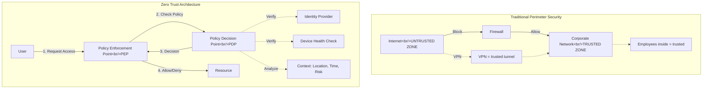

# Zero Trust Architecture & Future of IAM

## Introduction to Zero Trust

The traditional security model was based on a simple assumption: **"Everything inside the corporate network is trusted, everything outside is untrusted."**

This perimeter-based security (castle-and-moat model) worked when:
- Employees worked in offices
- Applications ran in on-premise data centers
- Data stayed within the corporate network

But modern reality is different:
- Remote work is standard
- Cloud SaaS applications are everywhere
- Mobile devices access corporate data
- Third-party contractors need access
- Attackers are already inside the network (assume breach)

**Zero Trust** replaces "trust but verify" with **"never trust, always verify."**

## Core Principles of Zero Trust

### 1. **Verify Explicitly**
Always authenticate and authorize based on all available data points:
- User identity
- Location
- Device health
- Service or workload
- Data classification
- Anomalies

### 2. **Use Least Privilege Access**
Limit user access with Just-In-Time (JIT) and Just-Enough-Access (JEA):
- Grant minimum privileges required
- Time-bound access
- Risk-based adaptive policies

### 3. **Assume Breach**
Minimize blast radius and segment access:
- Verify end-to-end encryption
- Use analytics to detect threats
- Improve detection, threat protection, and response

## Zero Trust vs. Traditional Security

| Aspect | Traditional Perimeter | Zero Trust |
|--------|---------------------|------------|
| **Philosophy** | Trust inside network | Never trust, always verify |
| **Access** | Broad network access | Micro-segmentation, least privilege |
| **Identity** | Secondary consideration | Primary security perimeter |
| **Device** | Managed devices trusted | Continuous device verification |
| **Authentication** | One-time at login | Continuous authentication |
| **Data Protection** | Perimeter firewall | End-to-end encryption, DLP |
| **Monitoring** | Perimeter-focused | All traffic, all users, all devices |

## Traditional vs. Zero Trust Architecture



## Zero Trust Architecture Components

### 1. Policy Decision Point (PDP)

The **brain** of Zero Trust that makes access decisions based on:

- **Identity signals**: User, service account, managed identity
- **Device signals**: Compliance, health, trust level
- **Context signals**: Location, time, network, risk score
- **Resource signals**: Sensitivity, classification, access patterns
- **Threat intelligence**: Known malicious IPs, attack patterns

**Example Decision Logic:**
```
IF user.mfaVerified = true
AND device.compliant = true
AND location.country IN allowed_countries
AND risk_score &lt; 30
AND resource.sensitivity = "medium"
THEN ALLOW access
ELSE DENY access
```

### 2. Policy Enforcement Point (PEP)

The **gatekeeper** that enforces decisions from the PDP:

- **Network-based PEP**: Firewall, VPN gateway, SD-WAN
- **Application-based PEP**: API gateway, reverse proxy, service mesh
- **Endpoint-based PEP**: Agent on device, DLP client
- **Cloud-based PEP**: Cloud access security broker (CASB)

### 3. Identity Provider (IdP)

Central source of truth for identities:

- Authenticates users (MFA, passwordless, biometric)
- Stores identity attributes
- Enforces authentication policies
- Issues tokens (OAuth, SAML, OIDC)

**Examples:** Azure AD, Okta, Auth0, Google Identity

### 4. Device Trust

Continuous verification of device posture:

- Operating system version
- Patch level
- Antivirus status
- Encryption enabled
- Firewall active
- No jailbreak/root
- MDM enrollment

**Technologies:** Microsoft Intune, Jamf, VMware Workspace ONE

### 5. Network Micro-Segmentation

Instead of flat networks, create granular zones:

```
Traditional: All apps in one network (lateral movement easy)

Zero Trust: Each app isolated
┌─────────┐   ┌─────────┐   ┌─────────┐
│  App 1  │   │  App 2  │   │  App 3  │
│ VLAN 10 │   │ VLAN 20 │   │ VLAN 30 │
└─────────┘   └─────────┘   └─────────┘
     ↓             ↓             ↓
  Firewall     Firewall     Firewall
     ↓             ↓             ↓
  Database     Database     Database
```

**Technologies:** Software-defined networking (SDN), service mesh (Istio, Linkerd)

### 6. Data Protection

Protect data everywhere:

- **At rest**: Encryption, key management (Azure Key Vault, AWS KMS)
- **In transit**: TLS 1.3, mTLS (mutual TLS)
- **In use**: Confidential computing, secure enclaves

**Data Loss Prevention (DLP):**
- Classify data (public, internal, confidential, restricted)
- Prevent unauthorized sharing
- Monitor data exfiltration

### 7. Analytics and Monitoring

Continuous monitoring and threat detection:

- User and Entity Behavior Analytics (UEBA)
- Security Information and Event Management (SIEM)
- Extended Detection and Response (XDR)
- Machine learning for anomaly detection

**Example Alerts:**
- User accessing 10x more files than usual
- Download of sensitive data at 2 AM
- Login from new country without travel notification
- Privilege escalation detected

## Implementing Zero Trust: Maturity Model

Most organizations can't implement Zero Trust overnight. Here's a **maturity model** for gradual adoption:

### Level 0: Traditional Security (Baseline)
- Perimeter firewall
- VPN for remote access
- Antivirus on endpoints
- Basic authentication (username + password)

**Risk:** Assumed trust inside network, lateral movement easy

### Level 1: Enhanced Identity Security
**Focus:** Identity as the primary perimeter

**Implementations:**
- ✅ Multi-Factor Authentication (MFA) for all users
- ✅ Single Sign-On (SSO) across applications
- ✅ Role-Based Access Control (RBAC)
- ✅ Centralized Identity Provider
- ✅ Password policies (complexity, rotation)

**Technologies:** Okta, Azure AD, Auth0

### Level 2: Device Trust & Conditional Access
**Focus:** Verify devices before granting access

**Implementations:**
- ✅ Mobile Device Management (MDM)
- ✅ Endpoint Detection and Response (EDR)
- ✅ Conditional access policies (device compliance required)
- ✅ Device health attestation
- ✅ Certificate-based authentication

**Technologies:** Microsoft Intune, CrowdStrike, Carbon Black

### Level 3: Micro-Segmentation & Least Privilege
**Focus:** Limit lateral movement

**Implementations:**
- ✅ Network micro-segmentation
- ✅ Just-In-Time (JIT) access
- ✅ Just-Enough-Access (JEA) / Privilege escalation workflows
- ✅ Service-to-service authentication (mTLS, service mesh)
- ✅ Fine-grained authorization (Zanzibar-style)

**Technologies:** HashiCorp Vault, Istio, AWS IAM, SpiceDB

### Level 4: Continuous Verification & Adaptive Policies
**Focus:** Real-time risk assessment

**Implementations:**
- ✅ Continuous Access Evaluation (CAE)
- ✅ Risk-based adaptive authentication
- ✅ User and Entity Behavior Analytics (UEBA)
- ✅ Anomaly detection with ML
- ✅ Automated threat response

**Technologies:** Microsoft Defender, Splunk, Palo Alto Cortex XDR

### Level 5: Full Zero Trust (Advanced)
**Focus:** Assume breach, complete visibility

**Implementations:**
- ✅ End-to-end encryption for all data
- ✅ Decentralized identity (DID/VC where applicable)
- ✅ Confidential computing for sensitive workloads
- ✅ Full network traffic inspection (east-west + north-south)
- ✅ Automated incident response and remediation
- ✅ Comprehensive audit logs and forensics

**Technologies:** Confidential VMs (Azure, AWS Nitro Enclaves), Network detection tools

## Measuring Progress

| Maturity Level | Identity Verified | Device Verified | Network Segmented | Data Encrypted | Continuous Monitoring |
|----------------|-------------------|-----------------|-------------------|----------------|----------------------|
| **Level 0** | ❌ | ❌ | ❌ | ❌ | ❌ |
| **Level 1** | ✅ | ❌ | ❌ | Partial | Basic |
| **Level 2** | ✅ | ✅ | Partial | Partial | Moderate |
| **Level 3** | ✅ | ✅ | ✅ | ✅ | Moderate |
| **Level 4** | ✅ | ✅ | ✅ | ✅ | Advanced |
| **Level 5** | ✅ | ✅ | ✅ | ✅ | Complete |

## Zero Trust Policy Engine Example (TypeScript)

```typescript
// Zero Trust Policy Decision Point (PDP) Implementation

interface User {"{"}
  id: string
  email: string
  roles: string[]
  mfaVerified: boolean
  riskScore: number
  lastLoginLocation?: string
{"}"}

interface Device {"{"}
  id: string
  compliant: boolean
  managed: boolean
  os: string
  osVersion: string
  encryptionEnabled: boolean
  antivirusActive: boolean
{"}"}

interface Context {"{"}
  ipAddress: string
  country: string
  isp: string
  timeOfDay: number // 0-23
  isAnonymousProxy: boolean
  isKnownMaliciousIP: boolean
{"}"}

interface Resource {"{"}
  id: string
  type: string
  sensitivity: 'public' | 'internal' | 'confidential' | 'restricted'
  requiredRoles: string[]
{"}"}

interface AccessRequest {"{"}
  user: User
  device: Device
  context: Context
  resource: Resource
  action: 'read' | 'write' | 'delete' | 'admin'
{"}"}

interface PolicyDecision {"{"}
  allowed: boolean
  reason: string
  requiresStepUp?: boolean
  stepUpMethods?: string[]
  conditions?: string[]
{"}"}

class ZeroTrustPolicyEngine {"{"}
  // Main decision function
  evaluateAccess(request: AccessRequest): PolicyDecision {"{"}
    // Rule 1: Always deny critical risk
    if (request.user.riskScore &gt; 80) {"{"}
      return {"{"}
        allowed: false,
        reason: 'User risk score too high (critical risk)',
      {"}"}
    {"}"}

    // Rule 2: Always deny non-compliant devices for confidential+ data
    if (
      !request.device.compliant &&
      ['confidential', 'restricted'].includes(request.resource.sensitivity)
    ) {"{"}
      return {"{"}
        allowed: false,
        reason: 'Device not compliant - required for confidential data access',
      {"}"}
    {"}"}

    // Rule 3: Always deny anonymous proxies for restricted data
    if (request.context.isAnonymousProxy && request.resource.sensitivity === 'restricted') {"{"}
      return {"{"}
        allowed: false,
        reason: 'Anonymous proxy detected - not allowed for restricted resources',
      {"}"}
    {"}"}

    // Rule 4: Always deny known malicious IPs
    if (request.context.isKnownMaliciousIP) {"{"}
      return {"{"}
        allowed: false,
        reason: 'Access from known malicious IP address',
      {"}"}
    {"}"}

    // Rule 5: Check RBAC - user must have required role
    const hasRequiredRole = request.resource.requiredRoles.some((role) =>
      request.user.roles.includes(role)
    )
    if (!hasRequiredRole) {"{"}
      return {"{"}
        allowed: false,
        reason: `Missing required role: ${"{"}{request.resource.requiredRoles.join(' or ')}{"}"}`,
      {"}"}
    {"}"}

    // Rule 6: MFA required for confidential/restricted resources
    if (
      !request.user.mfaVerified &&
      ['confidential', 'restricted'].includes(request.resource.sensitivity)
    ) {"{"}
      return {"{"}
        allowed: false,
        reason: 'Multi-factor authentication required',
        requiresStepUp: true,
        stepUpMethods: ['totp', 'push_notification', 'webauthn'],
      {"}"}
    {"}"}

    // Rule 7: Managed device required for restricted resources
    if (!request.device.managed && request.resource.sensitivity === 'restricted') {"{"}
      return {"{"}
        allowed: false,
        reason: 'Managed device required for restricted resources',
      {"}"}
    {"}"}

    // Rule 8: Encryption required for confidential+ resources
    if (
      !request.device.encryptionEnabled &&
      ['confidential', 'restricted'].includes(request.resource.sensitivity)
    ) {"{"}
      return {"{"}
        allowed: false,
        reason: 'Device encryption required',
      {"}"}
    {"}"}

    // Rule 9: Antivirus required for write/delete operations
    if (['write', 'delete', 'admin'].includes(request.action) && !request.device.antivirusActive) {"{"}
      return {"{"}
        allowed: false,
        reason: 'Active antivirus required for write/delete operations',
      {"}"}
    {"}"}

    // Rule 10: High-risk score requires additional verification
    if (request.user.riskScore &gt; 60 && request.resource.sensitivity === 'restricted') {"{"}
      return {"{"}
        allowed: false,
        reason: 'High risk score - additional verification required',
        requiresStepUp: true,
        stepUpMethods: ['push_notification', 'webauthn'],
      {"}"}
    {"}"}

    // Rule 11: Delete operations on restricted data require elevated privileges
    if (request.action === 'delete' && request.resource.sensitivity === 'restricted') {"{"}
      const hasDeletePrivilege = request.user.roles.includes('data_admin')
      if (!hasDeletePrivilege) {"{"}
        return {"{"}
          allowed: false,
          reason: 'Delete operations on restricted data require data_admin role',
        {"}"}
      {"}"}
    {"}"}

    // Rule 12: Time-based restrictions for restricted resources
    if (request.resource.sensitivity === 'restricted') {"{"}
      const isBusinessHours = request.context.timeOfDay &gt;= 8 && request.context.timeOfDay &lt; 18
      if (!isBusinessHours && !request.user.roles.includes('on_call')) {"{"}
        return {"{"}
          allowed: false,
          reason: 'Restricted resources only accessible during business hours (8am-6pm)',
        {"}"}
      {"}"}
    {"}"}

    // All checks passed - allow with conditions
    const conditions: string[] = []

    if (request.user.riskScore &gt; 30) {"{"}
      conditions.push('Enhanced logging enabled due to elevated risk score')
    {"}"}

    if (request.context.country !== 'US' && request.resource.sensitivity === 'restricted') {"{"}
      conditions.push('International access logged and flagged for review')
    {"}"}

    return {"{"}
      allowed: true,
      reason: 'All Zero Trust policies satisfied',
      conditions: conditions.length &gt; 0 ? conditions : undefined,
    {"}"}
  {"}"}

  // Helper: Calculate risk score based on context
  calculateRiskScore(user: User, device: Device, context: Context): number {"{"}
    let score = 0

    // User factors
    if (!user.mfaVerified) score += 20

    // Device factors
    if (!device.compliant) score += 15
    if (!device.managed) score += 10
    if (!device.encryptionEnabled) score += 10
    if (!device.antivirusActive) score += 10

    // Context factors
    if (context.isAnonymousProxy) score += 25
    if (context.isKnownMaliciousIP) score += 50
    if (context.timeOfDay &lt; 6 || context.timeOfDay &gt; 22) score += 5

    // Location change risk
    if (user.lastLoginLocation && user.lastLoginLocation !== context.country) {"{"}
      score += 15
    {"}"}

    return Math.min(score, 100)
  {"}"}
{"}"}

// Example usage
const policyEngine = new ZeroTrustPolicyEngine()

const accessRequest: AccessRequest = {"{"}
  user: {"{"}
    id: 'user-123',
    email: 'alice@example.com',
    roles: ['engineer', 'data_viewer'],
    mfaVerified: true,
    riskScore: 25,
  {"}"},
  device: {"{"}
    id: 'device-456',
    compliant: true,
    managed: true,
    os: 'macOS',
    osVersion: '14.2',
    encryptionEnabled: true,
    antivirusActive: true,
  {"}"},
  context: {"{"}
    ipAddress: '203.0.113.42',
    country: 'US',
    isp: 'Corporate Network',
    timeOfDay: 14,
    isAnonymousProxy: false,
    isKnownMaliciousIP: false,
  {"}"},
  resource: {"{"}
    id: 'resource-789',
    type: 'database',
    sensitivity: 'confidential',
    requiredRoles: ['data_viewer', 'data_admin'],
  {"}"},
  action: 'read',
{"}"}

const decision = policyEngine.evaluateAccess(accessRequest)
console.log('Access Decision:', decision)

// Example output:
// Access Decision: {"{"}
//   allowed: true,
//   reason: 'All Zero Trust policies satisfied',
//   conditions: undefined
// {"}"}
```

## The Future of IAM

### Emerging Trends (5-10 Year Horizon)

#### 1. **Passwordless Everywhere**
- Passkeys (FIDO2/WebAuthn) become default
- Biometric authentication standard
- Passwords relegated to legacy systems only
- **Timeline:** 2025-2027 mainstream adoption

#### 2. **Decentralized Identity Mainstream**
- Government-issued digital IDs (EU Digital Identity Wallet)
- Verifiable credentials for employment, education
- User-controlled identity portals
- **Timeline:** 2026-2028 for consumer adoption

#### 3. **AI-Powered Security**
- Real-time threat detection with ML
- Automated incident response
- Predictive risk scoring
- Deepfake detection in authentication
- **Timeline:** Already emerging, mainstream by 2025-2026

#### 4. **Quantum-Resistant Cryptography**
- Post-quantum algorithms (NIST standards)
- Migration from RSA/ECC to quantum-safe alternatives
- Hybrid classical/quantum crypto during transition
- **Timeline:** 2025-2030 migration period

#### 5. **Unified Identity Fabric**
- Single identity across cloud, on-premise, edge
- Seamless federation across all providers
- Identity mesh architecture
- **Timeline:** 2026-2029

#### 6. **Privacy-Preserving Authentication**
- Zero-knowledge proofs for authentication
- Homomorphic encryption for access decisions
- No personal data stored/transmitted
- **Timeline:** 2027-2030

#### 7. **Context-Aware Access (Extreme)**
- Brain-computer interfaces for authentication
- Continuous biometric monitoring (heart rate, gait)
- Environmental context (ambient sound, temperature)
- **Timeline:** 2030+

## Predictions for 2030

| Aspect | 2024 (Current) | 2030 (Predicted) |
|--------|---------------|------------------|
| **Primary Auth** | Password + MFA | Passkey (FIDO2) |
| **Secondary Auth** | TOTP, SMS | Biometric, behavioral |
| **Enterprise SSO** | SAML, OIDC | Verifiable Credentials |
| **Authorization** | RBAC, ABAC | ReBAC (Zanzibar-style) |
| **Token Format** | JWT | Verifiable Presentations |
| **Identity Storage** | Centralized IdP | Decentralized (DID) |
| **Access Model** | Perimeter-based | Zero Trust universal |
| **Risk Assessment** | Manual rules | AI-driven, predictive |
| **Cryptography** | RSA-2048, ECC-256 | Post-quantum algorithms |

## Skills to Learn Now for the Future

### 1. **Cryptography Fundamentals**
   - Understand public-key crypto (RSA, ECC)
   - Learn quantum-resistant algorithms (Kyber, Dilithium)
   - Zero-knowledge proofs

### 2. **Decentralized Technologies**
   - Blockchain basics (Ethereum, Hyperledger)
   - DID methods and resolution
   - Verifiable Credentials (W3C standards)

### 3. **AI/ML for Security**
   - Anomaly detection algorithms
   - Behavioral analytics
   - Threat intelligence platforms

### 4. **Zero Trust Architecture**
   - Policy-as-code (OPA, Cedar)
   - Service mesh (Istio, Linkerd)
   - Micro-segmentation

### 5. **Modern IAM Protocols**
   - OAuth 2.1 and extensions
   - OpenID Connect advanced features
   - FIDO2/WebAuthn implementation

## Final Thoughts

The future of IAM is:
- **User-centric**: You control your identity
- **Privacy-preserving**: Minimal data exposure
- **Continuous**: Always verifying, never trusting
- **Intelligent**: AI-powered risk assessment
- **Seamless**: Invisible to users when low-risk

The days of "username + password" are numbered. The question is not **if** we'll move to decentralized, passwordless, Zero Trust identity - but **when** and **how fast**.

**Your role as an IAM professional:** Stay ahead of these trends, experiment with emerging technologies, and help your organization prepare for the future of identity.
